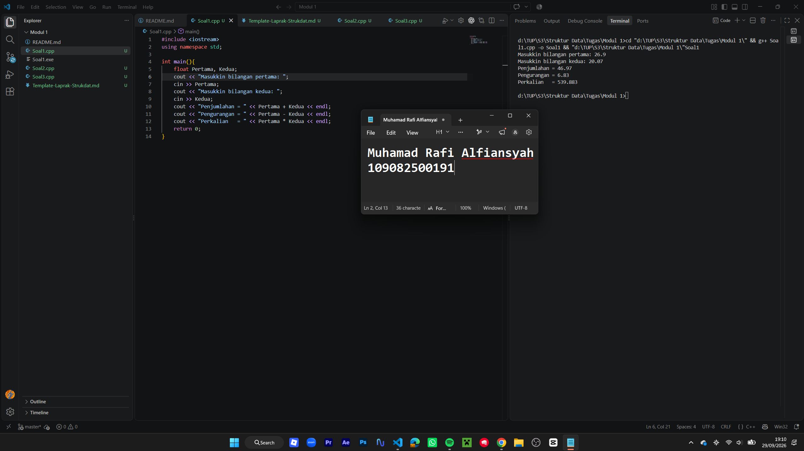
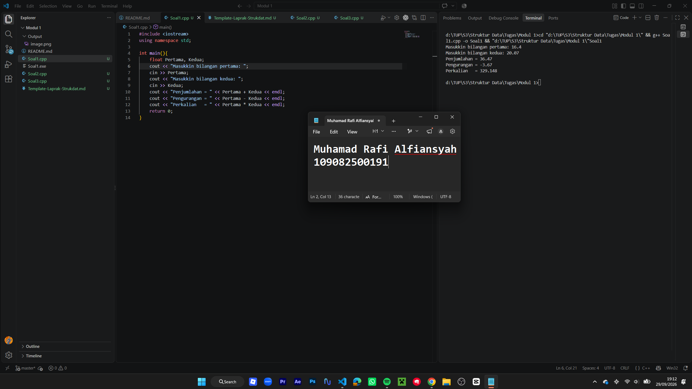
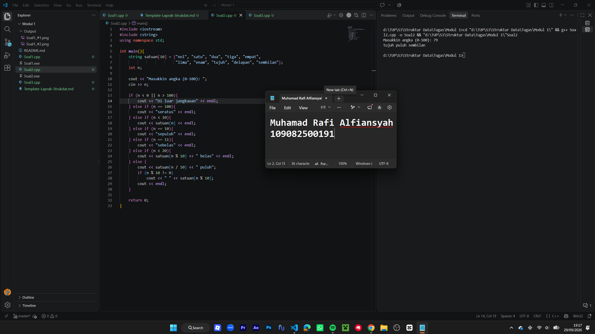
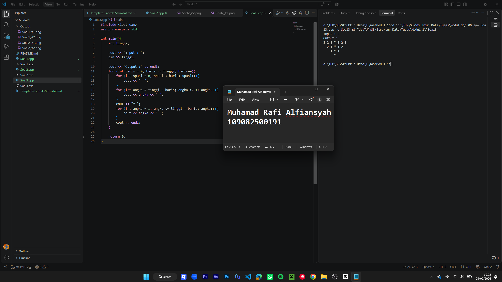

# **Laporan Praktikum Modul 1 \- Codeblocks IDE & Pengenalan Bahas C++ (Bagian Pertama)**

# 

Muhamad Rafi Alfiansyah \- 109082500191

## Dasar Teori

isi dengan penjelasan dasar teori disertai referensi jurnal (gunakan kurung siku \[\] untuk pernyataan yang mengambil refernsi dari jurnal). contoh : Linked list atau yang disebut juga senarai berantai adalah Salah satu bentuk struktur data yang berisi kumpulan data yang tersusun secara sekuensial, saling bersambungan, dinamis, dan terbatas\[1\]. Linked list terdiri dari sejumlah node atau simpul yang dihubungkan secara linier dengan bantuan pointer.

A. Linked List

### 

Linked list atau senarai berantai adalah struktur data linear yang terdiri dari kumpulan node atau simpul yang saling terhubung menggunakan pointer. Berbeda dengan array, data pada linked list tidak harus disimpan pada lokasi memori yang berurutan. Setiap node memiliki bagian data untuk menyimpan nilai dan bagian pointer untuk menunjuk node berikutnya.

#### 1\. Node merupakan elemen dasar pada linked list. Node digunakan untuk menyimpan data serta alamat node lain yang terhubung dengannya.


#### 2\. Pointer adalah variabel yang menyimpan alamat memori. Pada linked list, pointer berfungsi untuk menghubungkan satu node dengan node berikutnya.

#### 3\. Head merupakan pointer yang menunjuk pada node pertama dalam linked list. Head digunakan sebagai titik awal untuk melakukan penelusuran data.

B. Operasi Linked List

### 

Operasi pada linked list dilakukan dengan memanfaatkan pointer untuk mengatur hubungan antar-node. Operasi tersebut meliputi penambahan data, penghapusan data, serta penelusuran data dari node awal sampai node terakhir.

#### 1\. Penambahan node merupakan proses memasukkan node baru ke dalam linked list. Penambahan dapat dilakukan pada bagian awal, bagian akhir, atau pada posisi tertentu dengan mengubah pointer yang sesuai.


#### 2\. Penghapusan node merupakan proses menghilangkan node dari linked list. Proses ini dilakukan dengan menghubungkan pointer dari node sebelum node yang dihapus ke node setelahnya.

#### 3\. Traversal adalah proses mengunjungi atau menelusuri seluruh node pada linked list secara berurutan. Traversal dimulai dari node pertama atau head hingga mencapai node terakhir yang pointer-nya bernilai NULL.


## Guided

### 1\. ...

source code guided 1

penjelasan singkat guided 1

### 2\. ...

source code guided 2

penjelasan singkat guided 2

### 3\. ...

source code guided 3

penjelasan singkat guided 3

## Unguided

### 1\. (Buatlah program yang menerima input-an dua buah bilangan betipe float, kemudian memberikan output-an hasil penjumlahan, pengurangan, perkalian, dan pembagian dari dua bilangan tersebut.\)

```cpp
#include <iostream>
using namespace std;

int main(){
    float Pertama, Kedua;
    cout << "Masukkin bilangan pertama: ";
    cin >> Pertama;
    cout << "Masukkin bilangan kedua: ";
    cin >> Kedua;
    cout << "Penjumlahan = " << Pertama + Kedua << endl;
    cout << "Pengurangan = " << Pertama - Kedua << endl;
    cout << "Perkalian   = " << Pertama * Kedua << endl;
    return 0;
}
```

### Output Unguided 1 :

##### Output 1




##### Output 2



penjelasan unguided 1

### 2\. (Buatlah sebuah program yang menerima masukan angka dan mengeluarkan output nilai angka tersebut dalam bentuk tulisan. Angka yang akan di-input-kan user adalah bilangan bulat positif mulai dari 0 s.d 100\)

```cpp
#include <iostream>
#include <string>
using namespace std;

int main(){
    string satuan[10] = {"nol", "satu", "dua", "tiga", "empat",
                         "lima", "enam", "tujuh", "delapan", "sembilan"};
    int n;

    cout << "Masukkin angka (0-100): ";
    cin >> n;

    if (n < 0 || n > 100){
        cout << "Di luar jangkauan" << endl;
    } else if (n == 100){
        cout << "seratus" << endl;
    } else if (n < 10){
        cout << satuan[n] << endl;
    } else if (n == 10){
        cout << "sepuluh" << endl;
    } else if (n == 11){
        cout << "sebelas" << endl;
    } else if (n < 20){
        cout << satuan[n % 10] << " belas" << endl;
    } else {
        cout << satuan[n / 10] << " puluh";
        if (n % 10 != 0)
            cout << " " << satuan[n % 10];
        cout << endl;
    }

    return 0;
}
```

### Output Unguided 2 :

##### Output 1




##### Output 2


penjelasan unguided 2

### 3\. (Buatlah program yang dapat memberikan input dan output sbb.\)

```cpp
#include <iostream>
using namespace std;

int main(){
    int tinggi;

    cout << "Input : ";
    cin >> tinggi;

    cout << "Output :" << endl;
    for (int baris = 0; baris <= tinggi; baris++){
        for (int spasi = 0; spasi < baris; spasi++){
            cout << "  ";
        }
        for (int angka = tinggi - baris; angka >= 1; angka--){
            cout << angka << " ";
        }
        cout << "* ";
        for (int angka = 1; angka <= tinggi - baris; angka++){
            cout << angka << " ";
        }
        cout << endl;
    }

    return 0;
}
```

### Output Unguided 3 :

##### Output 1




##### Output 2


penjelasan unguided 3

## Kesimpulan

...

## Referensi

\[1\] Triase. (2020). Diktat Edisi Revisi : STRUKTUR DATA. Medan: UNIVERSTAS ISLAM NEGERI SUMATERA UTARA MEDAN.   
\[2\] Indahyati, Uce., Rahmawati Yunianita. (2020). "BUKU AJAR ALGORITMA DAN PEMROGRAMAN DALAM BAHASA C++". Sidoarjo: Umsida Press. Diakses pada 10 Maret 2024 melalui [https://doi.org/10.21070/2020/978-623-6833-67-4](https://doi.org/10.21070/2020/978-623-6833-67-4). 

...