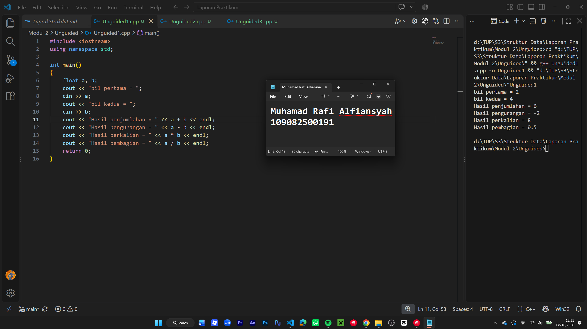
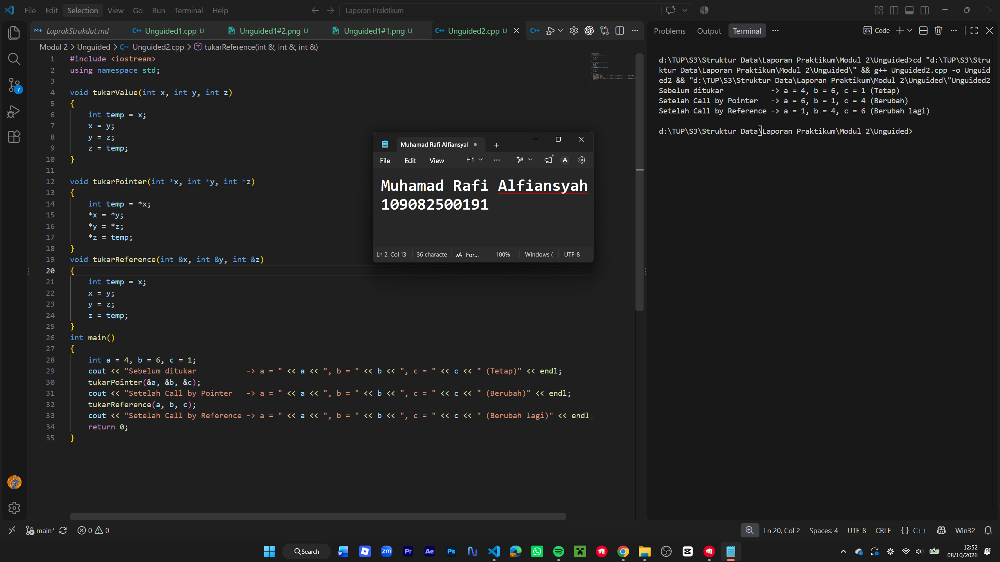
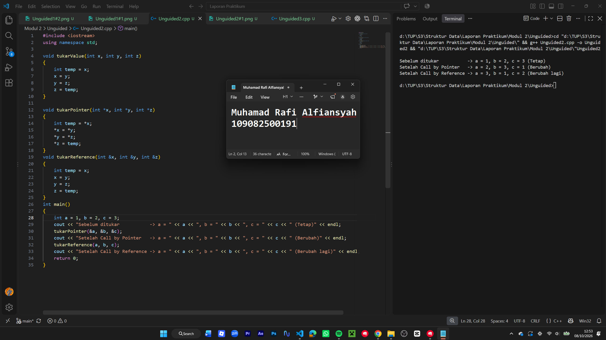
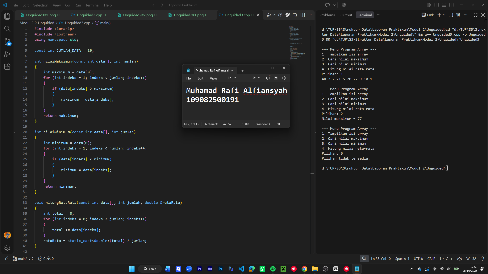
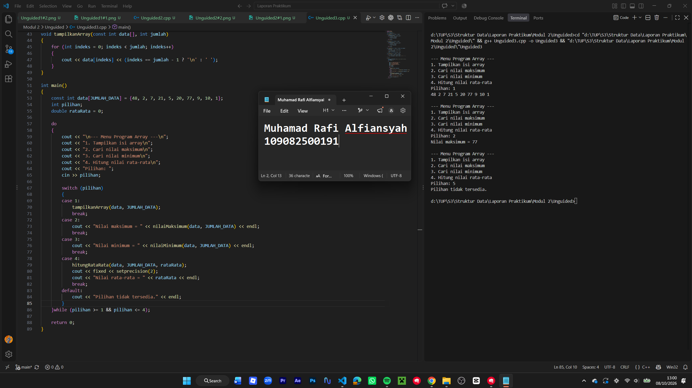

# <h1 align="center">Laporan Praktikum Modul 2 - Pengenalan Bahasa C++ (Bagian Kedua)</h1>

<p align="center">Muhamad Rafi Alfiansyah - 109082500191</p>

## Dasar Teori

Dalam pemrograman C++, data dan proses dalam program dapat dikelola menggunakan beberapa konsep dasar. Pada Modul 2, konsep yang dipelajari meliputi array, pointer, fungsi, prosedur, serta parameter. Masing-masing konsep memiliki kegunaan yang berbeda, tetapi dapat digunakan secara bersama-sama untuk membuat program yang lebih terorganisir dan mudah dikembangkan.

### A. Konsep Dasar C++

C++ memiliki berbagai fitur yang dapat digunakan untuk mengolah data dan membagi proses program menjadi beberapa bagian. Beberapa konsep yang digunakan pada praktikum ini adalah sebagai berikut.

#### 1. Array

Array digunakan untuk menampung beberapa data yang memiliki tipe data sama dalam satu variabel. Setiap data di dalam array memiliki posisi yang disebut indeks. Pada C++, indeks array dimulai dari angka `0`.
Array dapat dibuat dalam beberapa bentuk, seperti array satu dimensi dan array dua dimensi. Array satu dimensi cocok digunakan untuk menyimpan data dalam bentuk deretan, sedangkan array dua dimensi dapat digunakan untuk menyimpan data yang memiliki baris dan kolom, seperti sebuah tabel.

#### 2. Pointer

Pointer adalah variabel yang menyimpan alamat memori dari variabel lain. Alamat suatu variabel dapat diperoleh menggunakan operator `&`, sedangkan operator `*` digunakan untuk mengambil nilai yang berada pada alamat yang ditunjuk oleh pointer.
Dengan pointer, sebuah program dapat mengakses maupun mengubah nilai variabel melalui alamat memorinya. Pointer juga memiliki hubungan dengan array karena alamat elemen pertama array dapat digunakan sebagai acuan untuk mengakses elemen lainnya.

#### 3. Fungsi

Fungsi merupakan bagian program yang dibuat untuk mengerjakan suatu proses tertentu. Dengan membagi program ke dalam beberapa fungsi, kode menjadi lebih teratur dan bagian yang sama tidak perlu ditulis berulang kali.
Sebuah fungsi dapat menerima data melalui parameter dan dapat menghasilkan nilai yang dikembalikan menggunakan `return`. Tipe data pada fungsi menunjukkan jenis nilai yang akan dikembalikan.

#### 4. Prosedur

Prosedur merupakan bagian program yang digunakan untuk menjalankan suatu pekerjaan tanpa menghasilkan nilai balik. Dalam C++, prosedur umumnya dibuat menggunakan fungsi dengan tipe data `void`.
Penggunaan prosedur dapat membantu memisahkan tugas tertentu dari bagian utama program sehingga kode menjadi lebih mudah dibaca dan dikelola.

#### 5. Parameter Fungsi

Parameter digunakan sebagai media untuk memasukkan data ke dalam fungsi ketika fungsi tersebut dipanggil. Parameter yang dituliskan pada pembuatan fungsi disebut parameter formal, sedangkan nilai atau variabel yang diberikan saat pemanggilan disebut parameter aktual.
Dalam C++, parameter dapat diberikan dengan beberapa metode, yaitu `pass by value`, `pass by pointer`, dan `pass by reference`. Pada `pass by value`, fungsi menerima salinan dari nilai yang diberikan. Pada `pass by pointer`, fungsi menerima alamat dari variabel sehingga nilainya dapat diakses melalui pointer. Sementara itu, `pass by reference` membuat parameter mengacu langsung pada variabel asal.

## Guided

### 1\. ...

```C++
#include <iostream>
#define MAX 5
using namespace std;
int main()
{
    int i, j;
    float nilai_total, rata_rata;
    float nilai[MAX];
    static int nilai_tahun[MAX][MAX] =
        {{0, 2, 2, 0, 0},
         {0, 1, 1, 1, 0},
         {0, 3, 3, 3, 0},
         {4, 4, 0, 0, 4},
         {5, 0, 0, 0, 5}};
    /*inisialisasi array dua dimensi */
    for (i = 0; i < MAX; i++)
    {
        cout << "masukkan nilai ke-" << i + 1 << endl;
        cin >> nilai[i];
    }
    cout << "\ndata nilai siswa :\n";
    /*menampilkan array satu dimensi */
    for (i = 0; i < MAX; i++)
        cout << "nilai k-" << i + 1 << "=" << nilai[i] << endl;
    cout << "\n nilai tahunan : \n";
    /* menampilkan array dua dimensi */
    for (i = 0; i < MAX; i++)
    {
        for (j = 0; j < MAX; j++)
            cout << nilai_tahun[i][j];
        cout << "\n";
    }
    return 0;
}
```

Program menggunakan operator aritmatika dengan tanda kurung untuk mengatur urutan perhitungan dan menghasilkan nilai Z.

### 2\. ...

```C++
#include <iostream>
using namespace std;

int main(){
    int x, y;
    int *px;

    x = 87;
    px = &x;
    y = *px;

    cout << "Alamat x = " << &x << endl;
    cout << "Isi px = " << px << endl;
    cout << "Isi x = " << x << endl;
    cout << "Nilai yang ditunjuk px= " << *px << endl;
    cout << "Nilai y= " << y << endl;

    return 0;
}
```

Program menggunakan ++r, yaitu nilai r ditambah terlebih dahulu sebelum digunakan dalam perhitungan.

### 3\. ...

```C++
#include <iostream>
using namespace std;

int maks3(int a, int b, int c);
int main (){
    int x,y,z;
    cout << "masukkan nilai bilangan ke-1= ";
    cin >> x;
    cout << "masukkan nilai bilangan ke-2= ";
    cin >> y;
    cout << "masukkan nilai bilangan ke-3= ";
    cin >> z;
    cout << "nilai maksimum adalah= " << maks3(x,y,z) << endl;
    return 0;
}

int maks3(int a, int b, int c){
    int temp_maks;
    if (a > b && a > c)
        temp_maks = a;
    else if (b > a && b > c)
        temp_maks = b;
    else
        temp_maks = c;
    return temp_maks;
}
```

Program menggunakan r++, yaitu nilai r digunakan terlebih dahulu dalam perhitungan, kemudian nilainya ditambah.

### 4\. ...

```C++
#include <iostream>
using namespace std;

void tulis(int x);
int main(){
    int jum;
    cout << "jumlah bari kata = ";
    cin >> jum;
    tulis(jum);
    return 0;
}

void tulis(int x){
    for (int i = 1; i <= x; i++)
        cout << "baris ke-" << i << endl;
}
```

Program menggunakan if untuk memberikan diskon sebesar 5% apabila total pembelian mencapai Rp100.000 atau lebih.

### 5\. ...

```C++
#include <iostream>
using namespace std;

void tukar(int *x, int *y);

int main()
{
    int a, b;
    a = 4;
    b = 6;
    cout << "kondisi sebelum ditukar \n";
    cout << "a = " << a << " b = " << b << endl;

    tukar(&a, &b);

    cout << "kondisi setelah ditukar \n";
    cout << "a= " << a << " b = " << b << endl;
    return 0;
}

void tukar(int *x, int *y)
{
    int temp;
    temp = *x;
    *x = *y;
    *y = temp;
    cout << "nilai akhir pada fungsi tukar \n";
    cout << " x = " << *x << " y = " << *y << endl;
}
```

Program menggunakan if-else untuk menentukan diskon. Jika total pembelian memenuhi syarat, diberikan diskon 5%, jika tidak maka diskon bernilai 0.

## Unguided

### 1\. (Buatlah program yang dapat melakukan operasi penjumlahan, pengurangan, dan perkalian matriks 3x3.\)

```cpp
#include <iostream>
using namespace std;

int main()
{
    float a, b;
    cout << "bil pertama = ";
    cin >> a;
    cout << "bil kedua = ";
    cin >> b;
    cout << "Hasil penjumlahan = " << a + b << endl;
    cout << "Hasil pengurangan = " << a - b << endl;
    cout << "Hasil perkalian = " << a * b << endl;
    cout << "Hasil pembagian = " << a / b << endl;
    return 0;
}
```

### Output Unguided 1 :

##### Output 1




##### Output 2


Melakukan operasi aritmatika dari dua bilangan yang dimasukkin oleh user. Kedua bilangannya digunakan untuk menghitung penjumlahan, pengurangan, dan perkalian.

### 2\. (Berdasarkan guided pointer dan reference sebelumnya, buatlah keduanya dapat menukar nilai dari 3 variabel.\)

```cpp
#include <iostream>
using namespace std;

void tukarValue(int x, int y, int z)
{
    int temp = x;
    x = y;
    y = z;
    z = temp;
}

void tukarPointer(int *x, int *y, int *z)
{
    int temp = *x;
    *x = *y;
    *y = *z;
    *z = temp;
}
void tukarReference(int &x, int &y, int &z)
{
    int temp = x;
    x = y;
    y = z;
    z = temp;
}
int main()
{
    int a = 4, b = 6, c = 1;
    cout << "Sebelum ditukar           -> a = " << a << ", b = " << b << ", c = " << c << " (Tetap)" << endl;
    tukarPointer(&a, &b, &c);
    cout << "Setelah Call by Pointer   -> a = " << a << ", b = " << b << ", c = " << c << " (Berubah)" << endl;
    tukarReference(a, b, c);
    cout << "Setelah Call by Reference -> a = " << a << ", b = " << b << ", c = " << c << " (Berubah lagi)" << endl;
    return 0;
}
```

### Output Unguided 2 :

##### Output 1




##### Output 2



Mengubah angka 0-100 jadi tulisan. Programnya mengecek angka menggunakan if-else, lalu menampilkan kata yang sesuai, seperti 12 menjadi dua belas atau 25 jadi dua puluh lima. Kalo angka yang dimasukkin diluar 0_100, outputnya "Di luar jangkauan".  

### 3\. (Diketahui sebuah array 1 dimensi sebagai berikut : arrA = {48, 2, 7 , 21, 5, 20, 77, 9, 10, 1}. Buatlah program yang dapat mencari nilai minimum, maksimum, dan rata – rata dari array tersebut!\)

```cpp
#include <iomanip>
#include <iostream>
using namespace std;

const int JUMLAH_DATA = 10;

int nilaiMaksimum(const int data[], int jumlah)
{
    int maksimum = data[0];
    for (int indeks = 1; indeks < jumlah; indeks++)
    {
        if (data[indeks] > maksimum)
        {
            maksimum = data[indeks];
        }
    }
    return maksimum;
}

int nilaiMinimum(const int data[], int jumlah)
{
    int minimum = data[0];
    for (int indeks = 1; indeks < jumlah; indeks++)
    {
        if (data[indeks] < minimum)
        {
            minimum = data[indeks];
        }
    }
    return minimum;
}

void hitungRataRata(const int data[], int jumlah, double &rataRata)
{
    int total = 0;
    for (int indeks = 0; indeks < jumlah; indeks++)
    {
        total += data[indeks];
    }
    rataRata = static_cast<double>(total) / jumlah;
}

void tampilkanArray(const int data[], int jumlah)
{
    for (int indeks = 0; indeks < jumlah; indeks++)
    {
        cout << data[indeks] << (indeks == jumlah - 1 ? '\n' : ' ');
    }
}

int main()
{
    const int data[JUMLAH_DATA] = {48, 2, 7, 21, 5, 20, 77, 9, 10, 1};
    int pilihan;
    double rataRata = 0;

    do
    {
        cout << "\n--- Menu Program Array ---\n";
        cout << "1. Tampilkan isi array\n";
        cout << "2. Cari nilai maksimum\n";
        cout << "3. Cari nilai minimum\n";
        cout << "4. Hitung nilai rata-rata\n";
        cout << "Pilihan: ";
        cin >> pilihan;

        switch (pilihan)
        {
        case 1:
            tampilkanArray(data, JUMLAH_DATA);
            break;
        case 2:
            cout << "Nilai maksimum = " << nilaiMaksimum(data, JUMLAH_DATA) << endl;
            break;
        case 3:
            cout << "Nilai minimum = " << nilaiMinimum(data, JUMLAH_DATA) << endl;
            break;
        case 4:
            hitungRataRata(data, JUMLAH_DATA, rataRata);
            cout << fixed << setprecision(2);
            cout << "Nilai rata-rata = " << rataRata << endl;
            break;
        default:
            cout << "Pilihan tidak tersedia." << endl;
        }
    }while (pilihan >= 1 && pilihan <= 4);

    return 0;
}
```

### Output Unguided 3 :

##### Output 1




##### Output 2



Membuat pola angka berdasarkan tinggi yang dimasukkan. Perulangan for digunakan untuk mengatur spasi dan susunan angka, kemudian tanda * diletakkan di bagian tengah setiap baris sehingga membentuk pola tertentu.  

## Kesimpulan

Saya mempelajari dasar dari c++ seperti perator aritmatika, percabangan, perulangan, struct, array, dan fungsi. Masih butuh penyesuaian dari semester sebelumnya yang menggunakan Go, apalagi di panggunaan operator dan penulisan sintaksnya yang beda. Dari praktikum ini saya jadi lebih bisa memahami tentang c++.

## Referensi

\[1\] Triase. (2020). Diktat Edisi Revisi : STRUKTUR DATA. Medan: UNIVERSTAS ISLAM NEGERI SUMATERA UTARA MEDAN.   
\[2\] Indahyati, Uce., Rahmawati Yunianita. (2020). "BUKU AJAR ALGORITMA DAN PEMROGRAMAN DALAM BAHASA C++". Sidoarjo: Umsida Press. Diakses pada 10 Maret 2024 melalui [https://doi.org/10.21070/2020/978-623-6833-67-4](https://doi.org/10.21070/2020/978-623-6833-67-4). 

...